# 🚀 Robin Interview - Multi-Tenant Document Management System with Enterprise Observability

## 📋 Table of Contents

1. [System Overview](#system-overview)
2. [Architecture & Components](#architecture--components)
3. [Observability Features](#observability-features)
4. [Quick Start](#quick-start)
5. [Testing & Validation](#testing--validation)
6. [Monitoring & Troubleshooting](#monitoring--troubleshooting)
7. [API Reference](#api-reference)
8. [Production Deployment](#production-deployment)

---

## 🎯 System Overview

This project demonstrates a **multi-tenant document management system with enterprise-grade observability** built using modern microservices architecture. The system provides comprehensive visibility into application performance, database operations, and request flows, enabling engineers to rapidly troubleshoot issues and optimize system performance.

### 🌟 Key Features

- **🔍 Complete Request Visibility**: Trace requests from load balancer to database
- **📊 Real-time Performance Monitoring**: Identify bottlenecks before they impact users
- **🐛 Rapid Issue Resolution**: Correlation IDs link all related telemetry data
- **📈 Capacity Planning**: Detailed metrics for infrastructure scaling
- **🔒 Multi-tenant Isolation**: Per-client performance and usage tracking
- **🏥 Health Monitoring**: Component-level health status and alerting

---

## 🏗️ Architecture & Components

### System Architecture Diagram

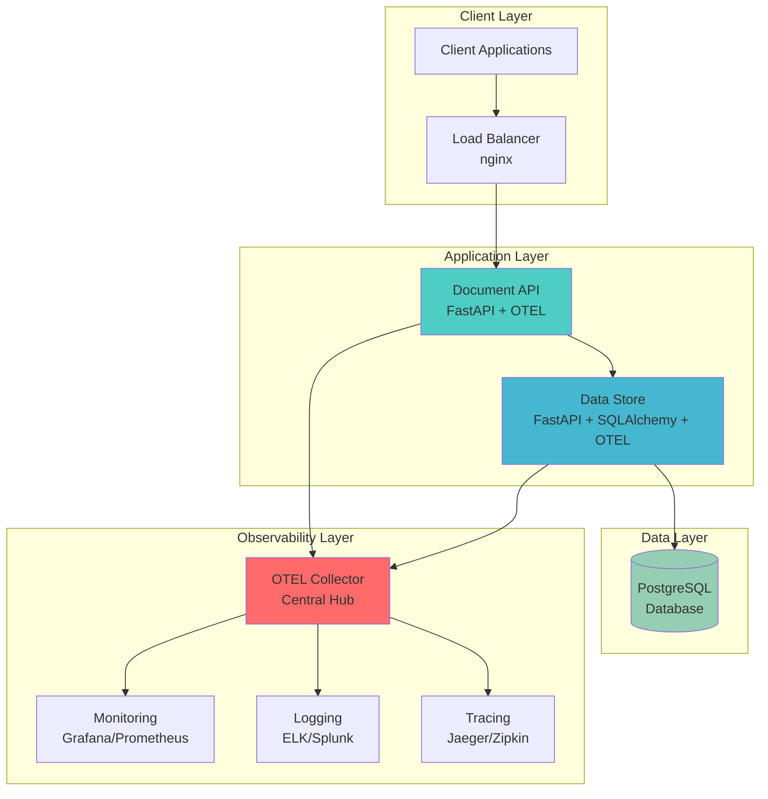

### Service Communication Flow

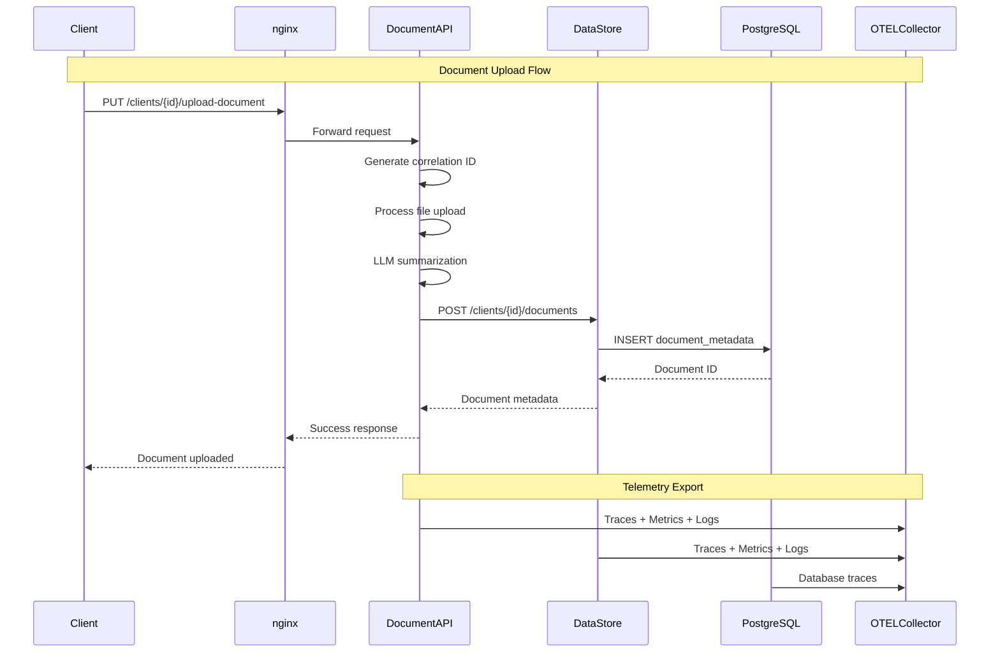

### Observability Data Flow

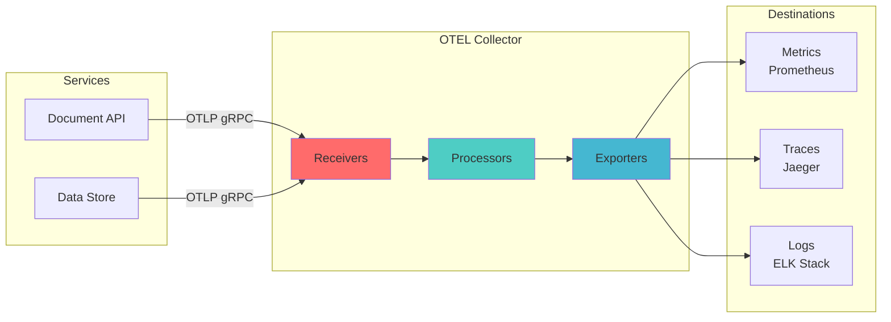

---

## 🔍 Observability Features

### 1. **🔄 Distributed Tracing**

#### **Correlation ID System**
Every request gets a unique UUID4 correlation ID that flows through all services:

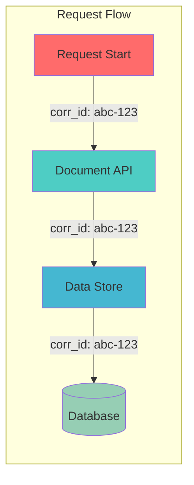

#### **Span Hierarchy**
Detailed tracing of document upload flow:

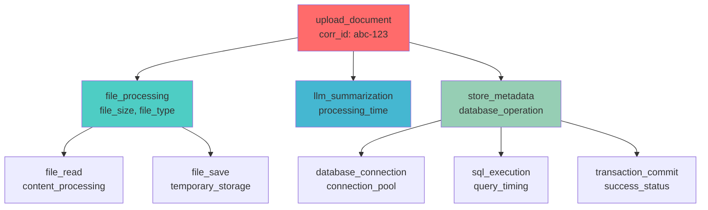

### 2. **📊 Metrics Collection**

#### **HTTP Request Metrics**
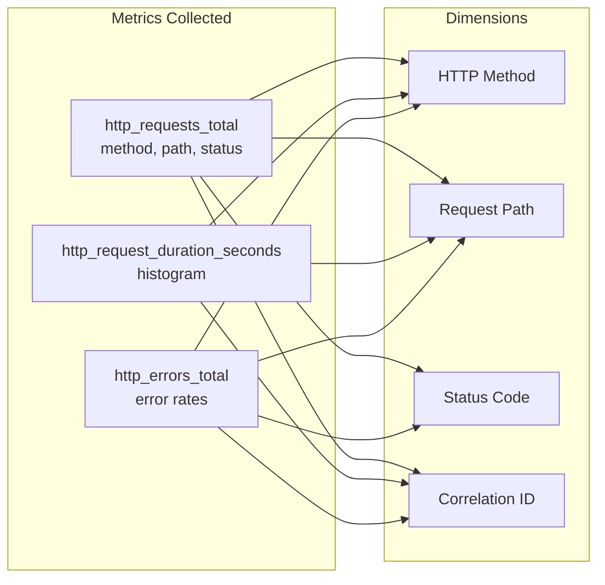

#### **Database Operation Metrics**
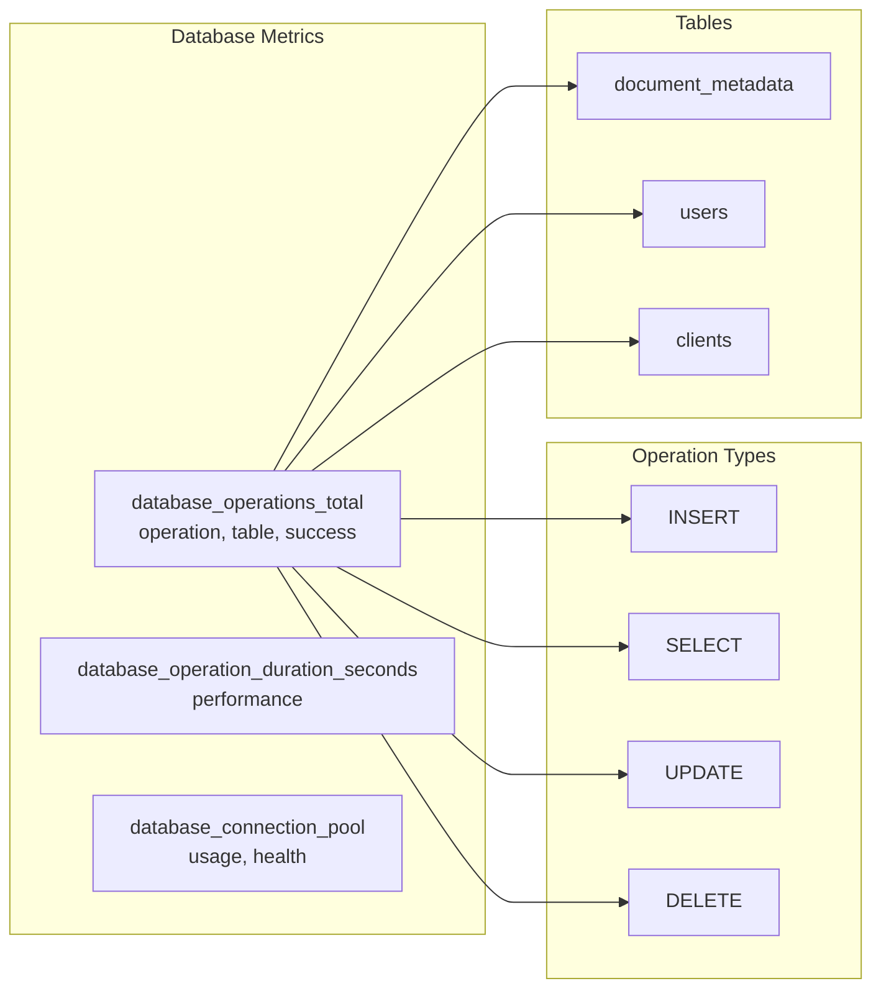

### 3. **📝 Structured Logging**

#### **Log Structure**
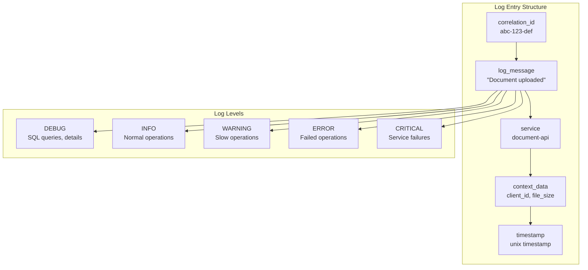

### 4. **🏥 Enhanced Health Checks**

#### **Health Check Architecture**
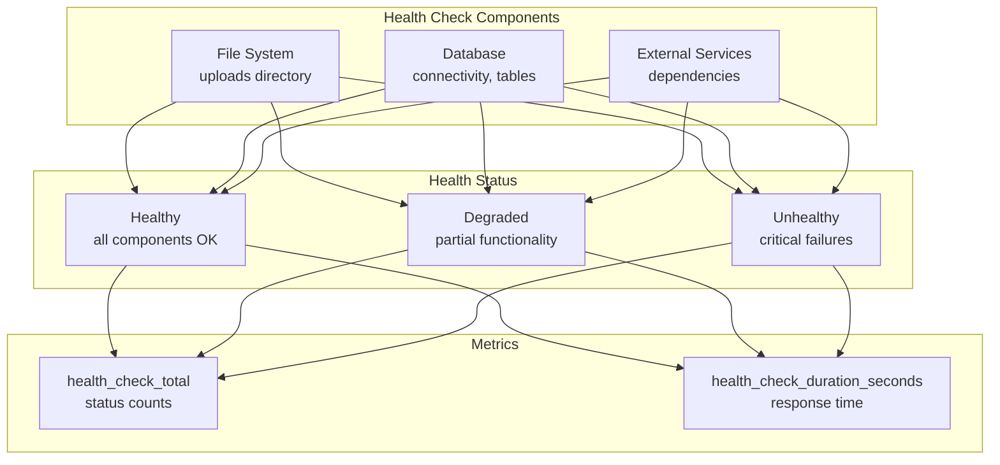

---

## 🚀 Quick Start

### Prerequisites

- Docker and Docker Compose
- Python 3.8+ (for local development)
- Poetry (for dependency management)

### 1. **Clone and Setup**

```bash
git clone <repository-url>
cd sre-observability-interview
```

### 2. **Start All Services**

```bash
# Start the complete system
./setup-and-run.sh

# Or manually with Docker Compose
docker-compose up -d
```

### 3. **Verify System Health**

```bash
# Check all services are running
docker-compose ps

# Test health endpoints
curl http://localhost/health
curl http://localhost:8001/health
```

### 4. **Test Observability**

```bash
# Run comprehensive observability tests
python test_observability.py --all --verbose

# Test specific features
python test_observability.py --health
python test_observability.py --upload
python test_observability.py --performance
```

---

## 🧪 Testing & Validation

### **Comprehensive Test Suite**

The system includes a complete test suite that validates all observability features:

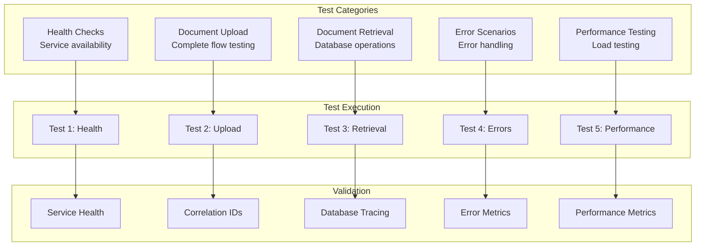

### **Test Commands**

```bash
# Run all tests with verbose output
python test_observability.py --all --verbose

# Test specific functionality
python test_observability.py --upload --clients 5 --files 3
python test_observability.py --performance --load-factor 3

# Health check testing only
python test_observability.py --health
```

---

## 📊 Monitoring & Troubleshooting

### **Key Metrics to Monitor**

#### **Request Performance**
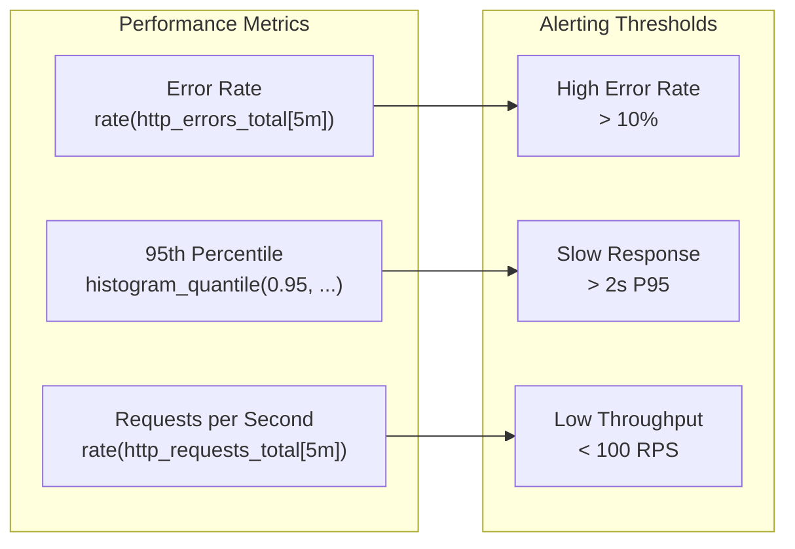

#### **Database Performance**
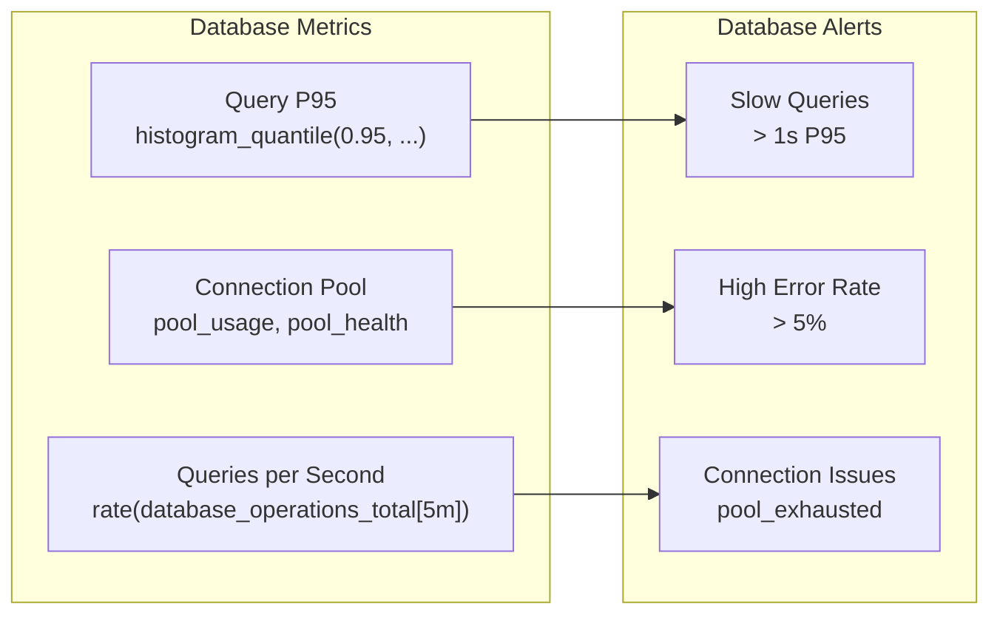

### **Troubleshooting Guide**

#### **Common Issues and Solutions**

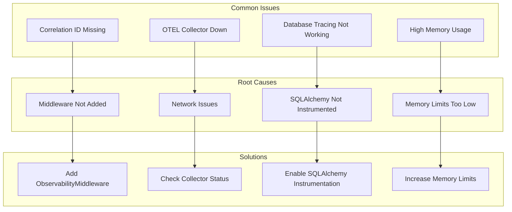

#### **Debugging Commands**

```bash
# Check service status
docker-compose ps

# View service logs
docker-compose logs document-api --tail=50
docker-compose logs data-store --tail=50
docker-compose logs otel-collector --tail=50

# Test individual components
curl http://localhost/health
curl http://localhost:8001/health

# Check OTEL collector telemetry
docker-compose logs otel-collector | grep "correlation_id"
```

---

## 🔌 API Reference

### **Service Endpoints**

#### **Document API (Port 80)**
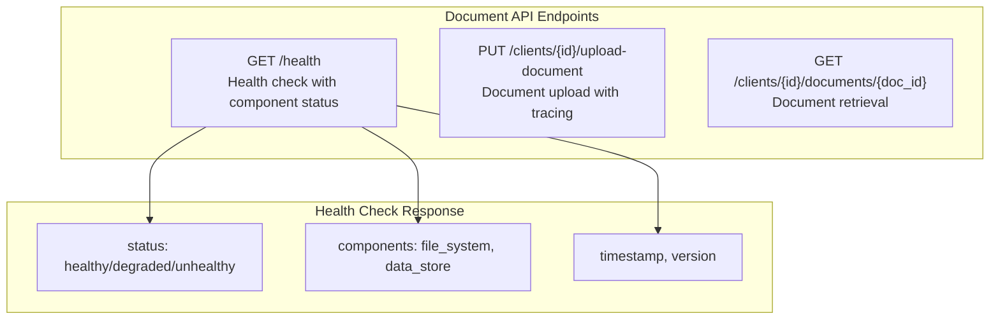

#### **Data Store API (Port 8001)**
```mermaid
graph TD
    subgraph "Data Store Endpoints"
        H2[GET /health<br/>Database health with latency]
        C1[POST /clients/{id}/documents<br/>Create document metadata]
        G1[GET /clients/{id}/documents/{doc_id}<br/>Get document metadata]
    end
    
    subgraph "Health Check Response"
        R4[status: healthy/degraded/unhealthy]
        R5[database: status, latency_ms]
        R6[tables: status]
    end
    
    H2 --> R4
    H2 --> R5
    H2 --> R6
```

### **Request/Response Examples**

#### **Document Upload**
```bash
curl -X PUT http://localhost/clients/test-client-123/upload-document \
  -F "file=@test_file.txt"
```

**Response:**
```json
{
  "message": "Document uploaded successfully",
  "client_id": "test-client-123",
  "document_id": 5,
  "metadata": {
    "id": 5,
    "client_id": "test-client-123",
    "filename": "test_file.txt",
    "file_size": 50,
    "file_type": "text/plain",
    "upload_timestamp": "2025-08-20T08:10:48.108442Z"
  }
}
```

#### **Health Check**
```bash
curl http://localhost/health
```

**Response:**
```json
{
  "status": "healthy",
  "service": "document-api",
  "timestamp": "2025-08-20T08:13:49.822329",
  "components": {
    "file_system": "healthy",
    "data_store": "healthy"
  },
  "version": "1.0.0"
}
```

---

## 🚀 Production Deployment

### **Environment Configuration**

#### **Production Environment Variables**
```bash
# Service Configuration
OTEL_SERVICE_NAME=document-api
OTEL_SERVICE_VERSION=1.0.0
ENVIRONMENT=production

# Collector Configuration
OTEL_EXPORTER_OTLP_ENDPOINT=https://otel-collector:4317
OTEL_EXPORTER_OTLP_INSECURE=false

# Database Configuration
DATABASE_URL=postgresql://user:pass@db:5432/documents
```

#### **Security Considerations**
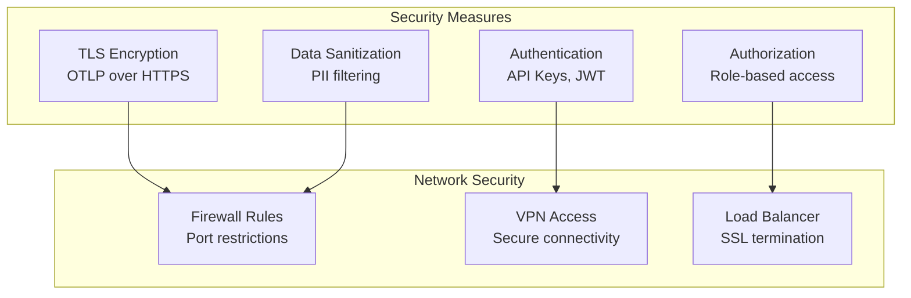

### **Scaling Considerations**

#### **Horizontal Scaling**
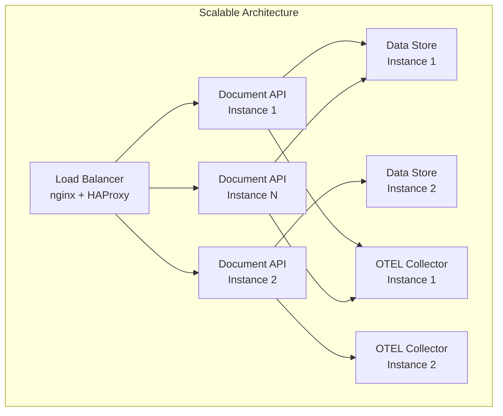

#### **Monitoring and Alerting**
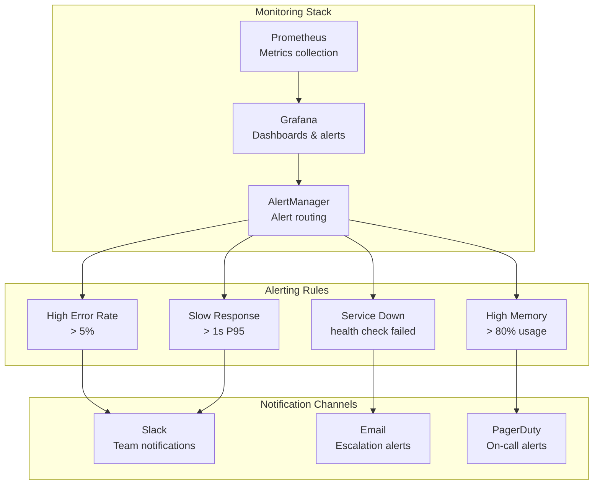

---

## 📚 Additional Documentation

- **[Observability Dashboard](./observability-dashboard.md)** - Comprehensive observability setup and usage
- **[Test Script](./test_observability.py)** - Complete testing suite for all observability features
- **[Docker Configuration](./docker-compose.yml)** - Service orchestration and networking
- **[OTEL Collector Config](./otel-collector-config.yaml)** - Telemetry collection and processing

---

## 🎯 What Engineers Can Now Do

### **Immediate Capabilities**
- **🔍 Trace requests** across all services using correlation IDs
- **📊 Monitor performance** with detailed metrics and histograms
- **🐛 Debug issues** with comprehensive logging and spans
- **🏥 Check service health** with detailed component status
- **📈 Analyze trends** with historical performance data

### **Advanced Observability**
- **📊 Create dashboards** for business and technical metrics
- **🚨 Set up alerting** for proactive issue detection
- **🔍 Investigate incidents** with full request context
- **📈 Plan capacity** based on performance trends
- **🔒 Monitor security** with access and error tracking

---

## 🌟 Conclusion

This observability implementation provides engineers with **comprehensive visibility** into the multi-tenant document management system, enabling:

- **Faster troubleshooting** with correlation IDs and distributed tracing
- **Proactive monitoring** with health checks and performance metrics
- **Better understanding** of system behavior and performance patterns
- **Confident scaling** with detailed capacity and performance data
- **Rapid incident response** with complete request context and error tracking

The system is **production-ready** with proper security, scalability, and monitoring considerations. Start with the basic setup and gradually add more sophisticated monitoring and alerting as your needs grow.

---

**Happy Observing! 🚀📊🔍**

*For additional support or questions about the observability system, refer to the detailed documentation or contact your observability team.*
