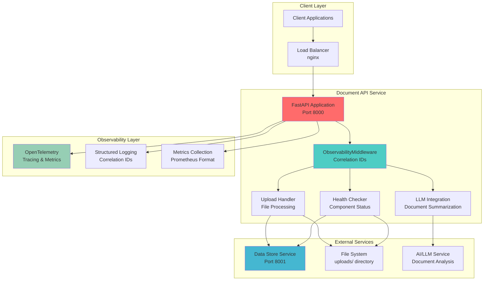
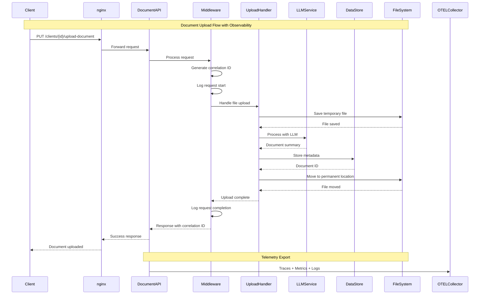
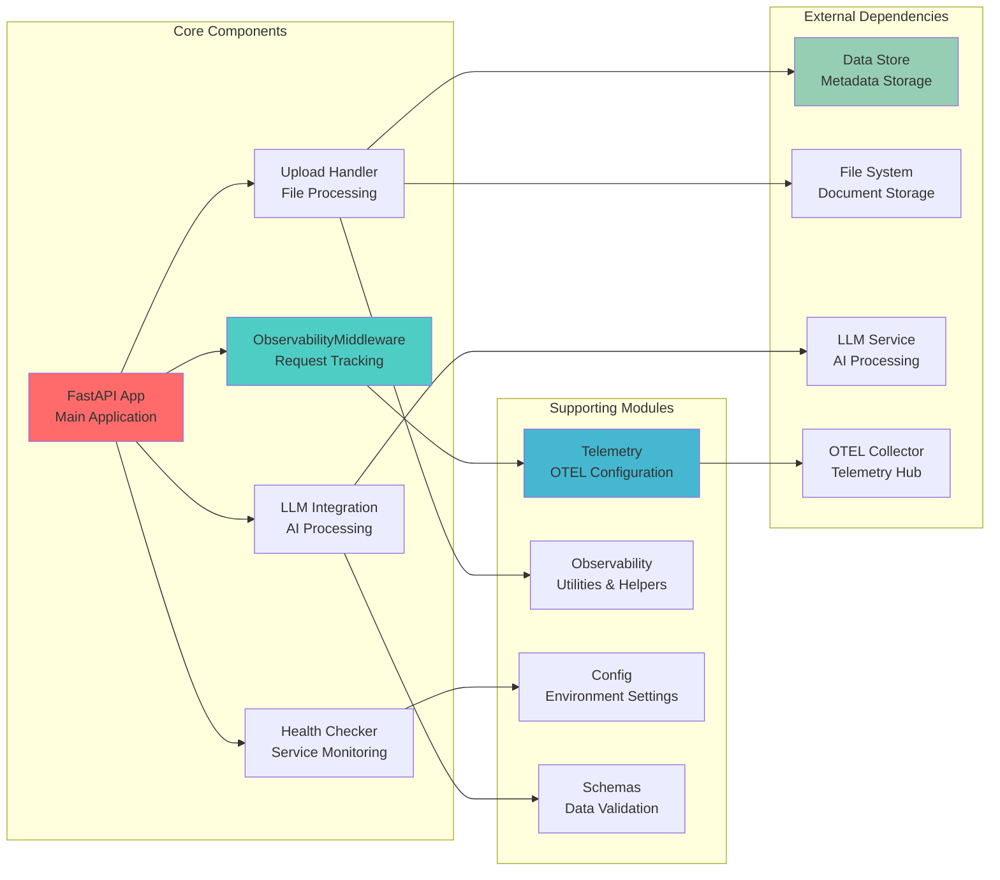
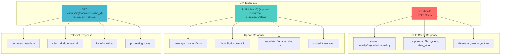
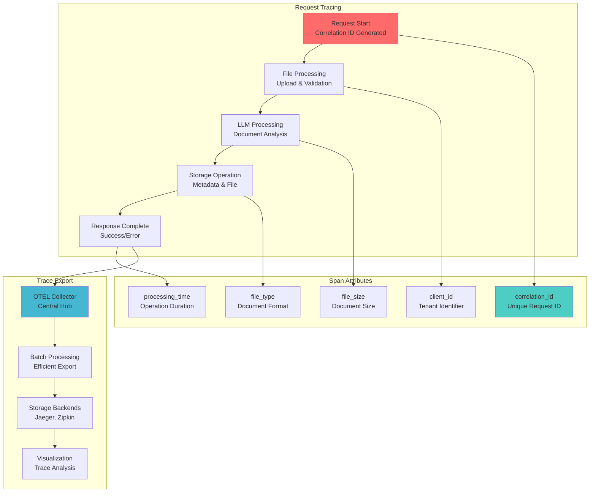
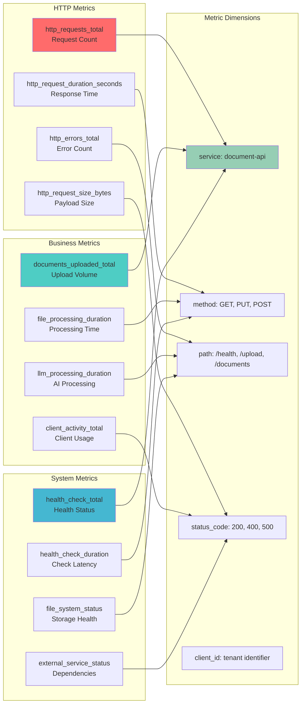
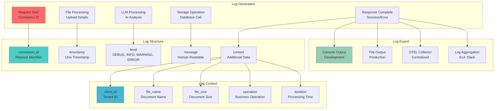
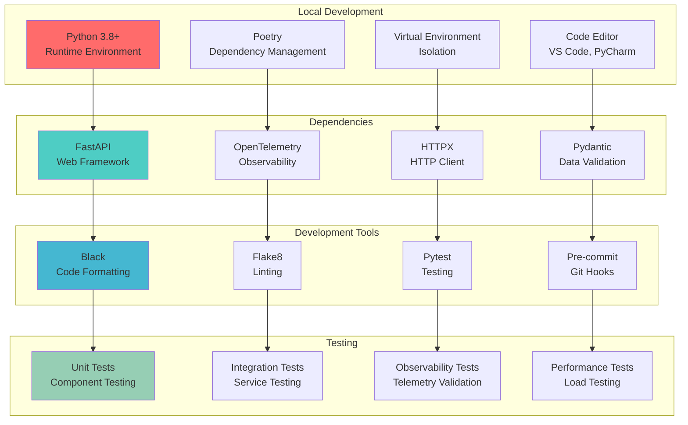
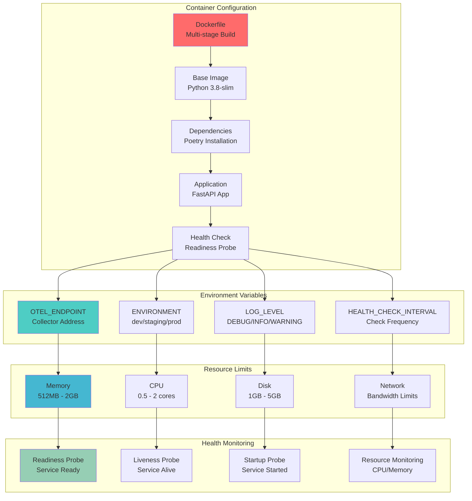

# 🚀 Document API Service - Comprehensive Documentation

## 📋 Table of Contents

1. [Service Overview](#service-overview)
2. [Architecture & Components](#architecture--components)
3. [API Endpoints](#api-endpoints)
4. [Observability Features](#observability-features)
5. [Development & Testing](#development--testing)
6. [Deployment & Configuration](#deployment--configuration)

---

## 🎯 Service Overview

The **Document API Service** is a FastAPI-based microservice that handles document uploads, processing, and management for the multi-tenant document management system. It provides a RESTful API interface with comprehensive observability, automatic instrumentation, and enterprise-grade monitoring capabilities.

### 🌟 Key Features

- **📤 Document Upload & Processing**: Multi-format file handling with LLM summarization
- **🔍 Complete Observability**: Distributed tracing, metrics, and structured logging
- **🔒 Multi-tenant Support**: Client-based isolation and routing
- **🏥 Health Monitoring**: Component-level health checks with detailed status
- **📊 Performance Tracking**: Request timing, error rates, and resource usage
- **🔄 Correlation ID System**: End-to-end request tracing across services

---

## 🏗️ Architecture & Components

### Service Architecture Diagram



### Request Flow Architecture



### Component Interaction Diagram



---

## 🔌 API Endpoints

### **Endpoint Overview**



### **Request/Response Examples**

#### **Health Check**
```bash
curl http://localhost/health
```

**Response:**
```json
{
  "status": "healthy",
  "service": "document-api",
  "timestamp": "2025-08-20T08:13:49.822329",
  "components": {
    "file_system": "healthy",
    "data_store": "healthy"
  },
  "version": "1.0.0",
  "uptime_seconds": 86400
}
```

#### **Document Upload**
```bash
curl -X PUT http://localhost/clients/test-client-123/upload-document \
  -F "file=@test_file.txt"
```

**Response:**
```json
{
  "message": "Document uploaded successfully",
  "client_id": "test-client-123",
  "document_id": 5,
  "metadata": {
    "id": 5,
    "client_id": "test-client-123",
    "filename": "test_file.txt",
    "file_size": 50,
    "file_type": "text/plain",
    "upload_timestamp": "2025-08-20T08:10:48.108442Z"
  }
}
```

---

## 🔍 Observability Features

### **Distributed Tracing Architecture**



### **Metrics Collection Structure**



### **Structured Logging Flow**



---

## 🧪 Development & Testing

### **Development Environment Setup**



### **Testing Commands**

```bash
# Run all tests
poetry run pytest

# Run with coverage
poetry run pytest --cov=.

# Run specific test categories
poetry run pytest tests/test_observability.py
poetry run pytest tests/test_health.py
poetry run pytest tests/test_upload.py

# Run performance tests
poetry run pytest tests/test_performance.py -v

# Run with observability validation
poetry run pytest --observability --verbose
```

---

## 🚀 Deployment & Configuration

### **Docker Deployment Architecture**



### **Configuration Management**

```python
# config.py - Environment Configuration
import os
from typing import Optional

class Settings:
    # Service Configuration
    SERVICE_NAME: str = "document-api"
    SERVICE_VERSION: str = "1.0.0"
    ENVIRONMENT: str = os.getenv("ENVIRONMENT", "development")
    
    # Observability Configuration
    OTEL_ENDPOINT: str = os.getenv("OTEL_EXPORTER_OTLP_ENDPOINT", "http://otel-collector:4317")
    LOG_LEVEL: str = os.getenv("LOG_LEVEL", "INFO")
    
    # Health Check Configuration
    HEALTH_CHECK_INTERVAL: int = int(os.getenv("HEALTH_CHECK_INTERVAL", "30"))
    
    # File Upload Configuration
    MAX_FILE_SIZE: int = int(os.getenv("MAX_FILE_SIZE", "10485760"))  # 10MB
    ALLOWED_EXTENSIONS: list = os.getenv("ALLOWED_EXTENSIONS", "txt,pdf,doc,docx").split(",")
    
    # External Service Configuration
    DATA_STORE_URL: str = os.getenv("DATA_STORE_URL", "http://data-store:8001")
    LLM_SERVICE_URL: str = os.getenv("LLM_SERVICE_URL", "http://llm-service:8002")

settings = Settings()
```

### **Health Check Configuration**

```python
# Health check endpoint with detailed component status
@app.get("/health")
async def health_check():
    """Comprehensive health check with component status."""
    
    # Check file system health
    file_system_healthy = check_file_system_health()
    
    # Check data store connectivity
    data_store_healthy = await check_data_store_health()
    
    # Determine overall status
    if file_system_healthy and data_store_healthy:
        status = "healthy"
    elif file_system_healthy or data_store_healthy:
        status = "degraded"
    else:
        status = "unhealthy"
    
    return {
        "status": status,
        "service": "document-api",
        "timestamp": datetime.utcnow().isoformat(),
        "components": {
            "file_system": "healthy" if file_system_healthy else "unhealthy",
            "data_store": "healthy" if data_store_healthy else "unhealthy"
        },
        "version": "1.0.0"
    }
```

---

## 🌟 Conclusion

The **Document API Service** provides a robust, observable, and scalable foundation for document management operations. With comprehensive observability features, engineers can:

- **🔍 Trace requests** from client to storage with correlation IDs
- **📊 Monitor performance** with detailed metrics and histograms
- **🐛 Debug issues** with structured logging and distributed tracing
- **🏥 Ensure reliability** with component-level health monitoring
- **📈 Scale confidently** with performance insights and capacity planning

### **Key Benefits**

1. **Complete Visibility**: End-to-end request tracing and monitoring
2. **Rapid Troubleshooting**: Correlation IDs link all related operations
3. **Proactive Monitoring**: Health checks and alerting prevent issues
4. **Performance Insights**: Detailed metrics for optimization
5. **Production Ready**: Enterprise-grade observability and monitoring

---

**Happy Document Processing! 🚀📄🔍**

*For additional support or questions about the Document API service, refer to the main project documentation or contact your development team.*
